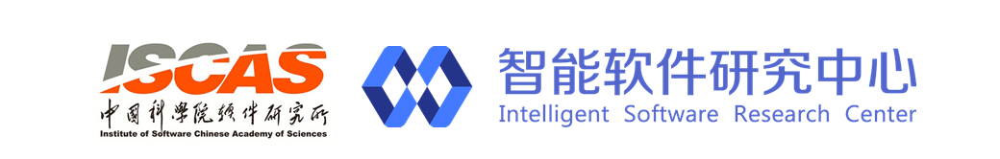

# 
《openEuler应用编程技术》

罗云翔

---

课程名称：Linux应用编程技术

学时：110

适用专业：计算机科学、计算机工程、信息安全、网络工程

先修课程：计算机组成原理/计算机导论与 C 语言程序设计/数据结构与算法分析

课件：《Linux应用编程技术》共计110课时，其中理论课40课时，实训70课时。包括理论课
PPT和课程文档，实训讲解PPT、实训指导书和参考答案源码。

教学目标：《Linux应用编程技术》是计算机专业的一门专业课程。在计算机系统中,操作系统是所有软件的基础,是软件的根本,是计算机系统中的核心系统软件,专门控制和管理计算机系统中的各种软硬件资源,提供了用户与计算机之间的接口,其性能直接影响到计算机系统的工作效率,另外,操作系统安全也是系统安全的基础。过本课程的学习,使学生能够系统地掌握 以openEuler操作系统为代表的Linux操作系统基本概念、主要功能、工作原理和实现技术;为在操作系统平台上开发各种应用软件打下坚实的基础。本课程以丰富、大量的实验练习为特色,将现实中的开发课题分解为学生练习,让学生在真实的项目攻关中培养科技创新意识和创新能力。教学目标是使学生具备熟练的openEuler等Linux系统环境下应用程序设计、编写、调试、运行跟踪的综合能力。课程具体内容及基本要求

## 课程大纲
[第一章 Linux和openEuler简介(6学时)](./chapter1)
    第一章 第一讲 Linux和openEuler的发展历史(1学时)
    第一章 第二讲 Linux和openEuler许可证和版权(1学时)
    第一章 实训一 openEuler操作系统的安装(基于qemu/树莓派)(2学时)
    第一章 实训二 安装开发环境(2学时)
[第二章 openEuler下C语言开发与调试(14学时)](./chapter2)
    第二章 第一讲 VIM、GCC、GDB(2学时)
    第二章 第二讲 MakeFile(2学时)
    第二章 第三讲 GDB下的程序调试(1学时)
    第二章 第四讲 git版本控制工具(1学时)
    第二章 实训一 VIM和GCC练习(2学时)
    第二章 实训二 Makefile使用(2学时)
    第二章 实训三 程序调式练习(2学时)
    第二章 实训四 git练习(2学时)
[第三章 第3章Shell(14学时)](./chapter3)
    第三章 第一讲 Shell编程基础(2学时)
    第三章 第二讲 Shell编程实例(2学时)
    第三章 实训一 Shell编程入门(4学时)
    第三章 实训二 Shell系统管理(4学时)
    第三章 实训三 Shell网络管理(2学时)
[第四章 程序库(16学时)](./chapter4)
    第四章 第一讲 程序库基础(2学时)
    第四章 第二讲 创建库和使用库(2学时)
    第四章 实训一 静态库开发(4学时)
    第四章 实训二 共享库开发(4学时)
    第四章 实训三 系统文件操作开发(4学时)
[第五章 进程与线程(10学时)](./chapter5)
    第五章 第一讲 进程与线程基础(2学时)
    第五章 第二讲 进程与线程编程(2学时)//是否和第七章的并发有对应基础描述
    第五章 实训一 程序状态监控(2学时)
    第五章 实训二 父子进程间的交互(2学时)
    第五章 实训三 测试共享内存的实际性能(2学时)
[第六章 文件系统应用(10学时)](./chapter6)
    第六章 第一讲 文件系统基础(2学时)
    第六章 第二讲 文件管理和目录编程(2学时)
    第六章 实训一 文件设置和编辑(2学时)
    第六章 实训二 文件搜索(2学时)
    第六章 实训三 文件比较(2学时)
[第七章 网络应用编程(12学时)](./chapter7)
    第七章 第一讲 网络基础(2学时)
    第七章 第二讲 Socket网络编程(2学时)
    第七章 实训一 C/S模式通信程序(2学时)
    第七章 实训二 字符串传输程序(2学时)
    第七章 实训三 文件传输程序(2学时)
    第七章 实训四 并发优化的文件传输程序(2学时)
[第八章安全应用编程(12学时)](./chapter8)
    第八章 第一讲 Linux安全程序编写安全编程意义及问题(2学时)
    第八章 第二讲 代码安全问题检测(2学时)
    第八章 实训一 数据的采集(2学时)
    第八章 实训二 未修复漏洞静态检测工具设计与开发(2学时)
    第八章 实训三 系统文件操作开发(2学时)
    第八章 实训四 模糊测试工具设计与开发(2学时)
[第九章Kunpeng及Arm处理加速编程(8课时)](./chapter9)
    第九章 第一讲 Kunpeng及Arm架构加速器及指令介绍(2学时)
    第九章 第二讲 Kunpeng加速器接口API简介(2学时)
    第九章 实训一 基于加速器API调用简单应用开发实践与对比验证一(2学时)
    第九章 实训二 基于加速器API调用简单应用开发实践与对比验证二(2学时)
[第十章内核入门和编译(8课时)](./chapter10)
    第十章 第一讲 Linux内核的发展历史和GPL(2学时)
    第十章 第二讲 Linux内核基础知识简介(2学时)
    第十章 实训一 Linux和openEuler内核编译和安装(2学时)
    第十章 实训二 Linux内核分布式编译环境分析和搭建(2学时)

---
## Copyright

